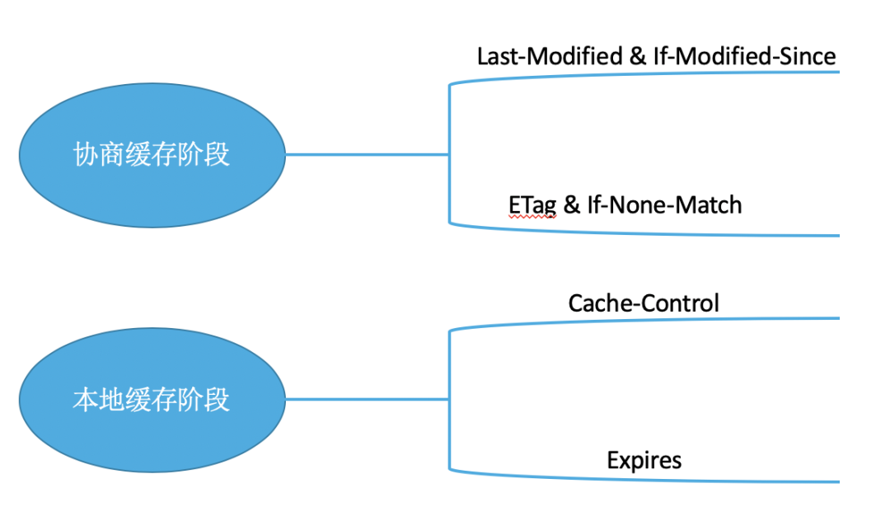

# 彻底弄懂浏览器缓存策略

> 浏览器缓存策略对于前端开发同学来说不陌生，大家都有一定的了解，但如果没有系统的归纳总结，可能三言两语很难说明白，甚至说错，尤其在面试过程中感触颇深，很多候选人对这类基础知识竟然都是一知半解，说出几个概念就没了，所以重新归纳总结下，温故而知新。

## Web 缓存介绍

- Web 缓存是指一个 Web 资源（如 HTML 页面，图片，JavaScript，数据等）存在于 Web 服务器和客户端（浏览器）之间的副本。
- 缓存会根据进来的请求保存输出内容的副本；当下一个请求来到的时候，如果是相同的 URL，缓存会根据缓存机制决定是直接使用副本响应访问请求，还是向源服务器再次发送请求。

## Web 缓存的好处

- 减少网络延迟，加快页面打开速度
- 减少网络带宽消耗
- 降低服务器压力
- ……

## HTTP 的缓存机制

简化的流程如下


根据什么规则缓存

1. 新鲜度（过期机制）：也就是缓存副本有效期。一个缓存副本必须满足以下条件，浏览器认为它是有效的，足够新的。
   - 含有完整的过期时间控制头信息（HTTP 协议报头），并且仍在有效期内；
   - 浏览器已经使用过这个缓存副本，并且在一个绘画中已经检查过新鲜度。
2. 校验值（验证机制）：服务器返回资源的时候在控制头信息带上这个资源的实体标签 ETag（Entity Tag），它可以用来作为浏览器再次请求过程的校验标识。如果发现校验标识不匹配，说明资源已经被修改或过期，浏览器需要重新获取资源内容。

## HTTP 缓存的两个阶段

浏览器缓存一般分为两类：强缓存（也称为本地缓存）和协商缓存（也称为弱缓存）。

**本地缓存阶段**

浏览器发送请求前，会先去缓存里查看是否命中强缓存，如果命中，则直接从缓存中读取资源，不会发送请求到服务器。否则，进入下一步。

**协商缓存阶段**

当强缓存没有命中时，浏览器一定会想服务器发起请求。服务器会根据 Request Header 中的一些字段来判断是否命中协商缓存。如果命中，服务器会返回 304 响应，但是不会携带任何响应实体，只是告诉浏览器可以直接从浏览器缓存中获取这个资源。如果本地缓存和协商缓存都没有命中，则直接从服务器加载资源。

**启用 & 关闭缓存**

按照本地缓存阶段和协商缓存阶段分类：



1. 使用 HTTP Meta 标签，Web 开发者可以在 HTML 页面的节点中加入标签，如下：

    ```html
    <meta http-equiv="Cache-Control" content="no-cache, no-store, must-revalidate"/>
    <meta http-equiv="Pragma" content="no-cache"/>
    <meta http-equiv="Expires" content="0" />
    ```

    上述代码的作用是告诉浏览器当前页面不被缓存，事实上这种禁用缓存的形式用处很有限：

      1. 仅有 IE 才能识别该 `meta` 标签含义，其他主流浏览器仅识别 `“Cache-Control: no-store”` 的 `meta` 标签；
      2. 在 IE 中识别到该 `meta` 标签含义，并不一定会在请求字段加上 Pragma，但的确会让当前页面每次都发送新请求（仅限页面，页面上的资源不受影响）。

2. 使用缓存有关的 HTTP 消息报头，这里需要了解 HTTP 的基础知识。一个 URL 的完整 HTTP 协议交互过程是由 HTTP 请求和 HTTP 响应组成的。有关 HTTP 详细内容可参考 《Hypertext Transfer Protocol — HTTP/1.1》、《HTTP 权威指南》等。

  在 HTTP 请求和响应的消息报头中，常见的与缓存相关的消息报头有：

  | 规则 | 消息报头 | 值 / 示例 | 类型 | 作用 |
  | ---- | -------- | --------- | ---- | ---- |
